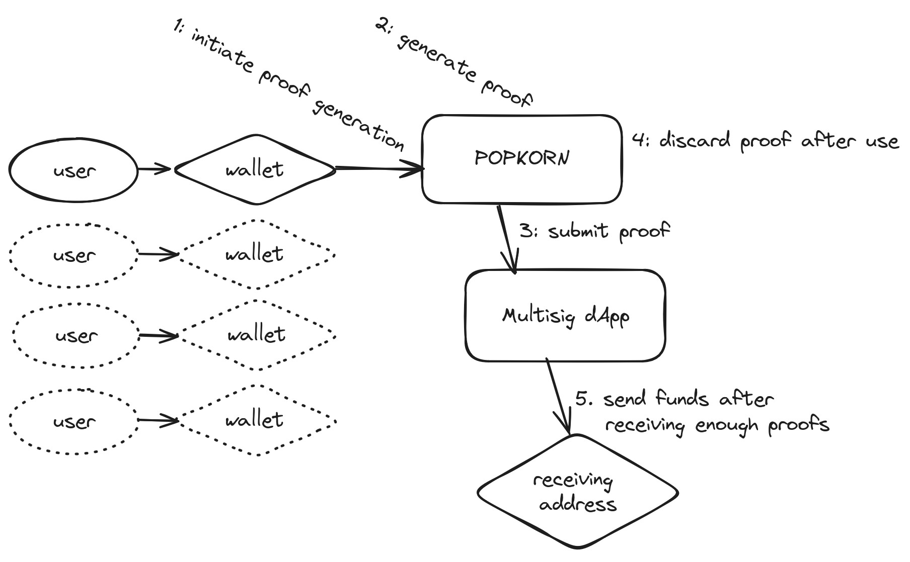

 # POPKORN: Zero-Knowledge MultiSig for Mina Protocol

## Project Background

POPKORN is an innovative MultiSig wallet solution built on Mina, leveraging O1js, to streamline how users interact with blockchain applications. By utilizing zero-knowledge proofs for authentication and transaction authorization, POPKORN creates a faster, more user-friendly MultiSig experience with fewer pop-ups, while maintaining robust security.

### Problem

Traditional MultiSig wallets often require complex coordination and multiple interactions, creating a barrier to adoption and efficient use. This complexity can deter users from leveraging the enhanced security benefits of MultiSig solutions.

### Solution

POPKORN introduces a streamlined approach to MultiSig wallets on Mina:

1. Faster proof generation for each transaction by multiple users
2. Efficient MultiSig dApp to aggregate and verify proofs
3. Significantly reducing the number of pop-ups and user interactions

While the focus of this proposal is on developing a MultiSig MVP, our long-term vision is to extend this solution into a standalone framework. This framework will empower all Mina applications to replace traditional signing mechanisms with zero-knowledge proofs, enhancing both security and user experience across the ecosystem.

## Architecture & Design

### Detailed Design

1. Wallet Connection and Multisig Setup:
  * Users connect their standard Mina wallet to the POPKORN zkApp
  * Within the dApp, users can create a new multisig wallet
  * Setup includes specifying signers, confirmation threshold, hierarchy and other parameters
2. Multisig Wallet Creation:
  * Users define the number of signers and required confirmations
  * Network fee (1 MINA) for new account setup is covered by the deployer
3. Transaction Proposal and Signing:
  * Any signer can propose a transaction from the multisig wallet
  * Other signers are notified and can review the transaction
  * POPKORN generates zero-knowledge proofs for signer approval, replacing traditional signatures
4. Proof Aggregation and Execution:
  * The multisig contract receives and verifies proofs from authorized signers
  * Proofs are aggregated until the required threshold is met
  * Once the threshold is reached, the transaction is automatically executed
5. Wallet Management:
  * Users can modify the number of signers and required confirmations after creation
  * The dApp provides a user-friendly interface for managing the multisig wallet

### Vision

To establish POPKORN as the go-to MultiSig solution on Mina, we aim to:

1. Provide a seamless, user-friendly interface for creating and managing multisig wallets
2. Minimize user interactions required for secure MultiSig transactions while maintaining robust security
3. Lay the foundation for a universal proof-based signing solution that can be integrated into any Mina dApp in the future.

## Risks & Mitigations

### Risks

1. Potential vulnerabilities in proof handling
2. User adoption challenges
3. Compatibility with existing Mina infrastructure

### Mitigations

1. Rigorous security audits and leveraging Mina's native security features
2. Focus on intuitive UX design and user education
3. Close collaboration with Mina community for seamless integration

## Additional Considerations

* Explore synergies with other Mina ecosystem projects
* Prioritize scalability for growing user base
* Establish a roadmap for evolving the MultiSig solution into a universal proof-based authentication framework for all Mina dApps.

## Team Info

### Team Members

* arjanjohan - [Github](https://github.com/arjanjohan) - [Twitter](https://twitter.com/arjanjohan)
* Kacper [Github](https://github.com/cleanerzkp) - [Twitter](https://twitter.com/0xcleaner)
